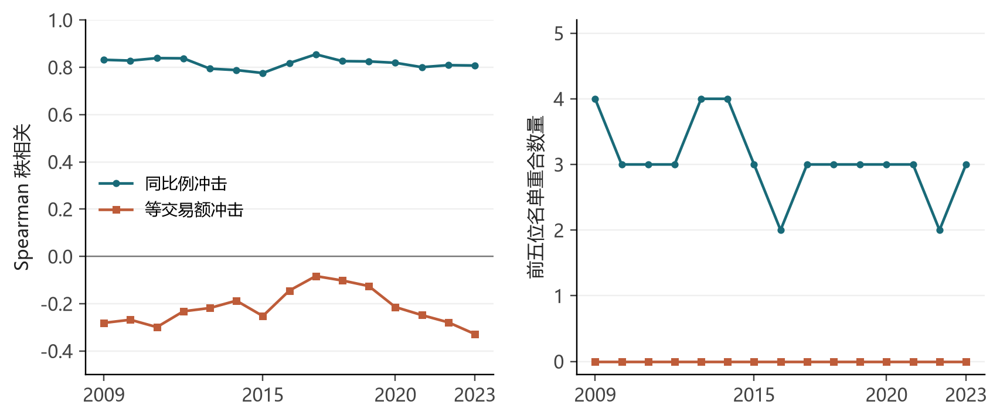
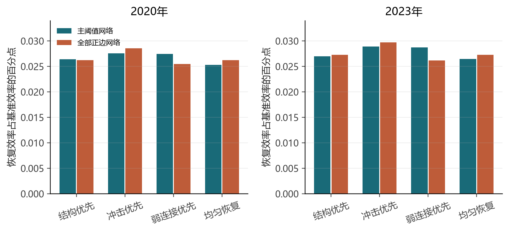

# 结果与结论

## 1. 结构重要性依赖冲击定义

2023 年主网络有 364 条边，密度 0.211382，加权效率 C=0.019704751。2009 年 C=0.018326524。这里的 C 不与第一案例的二元效率直接比较。

| 排名 | 2023 年前五 |
| --- | --- |
| 结构 TOPSIS | S34、S10、S29、S33、S12 |
| 同比例冲击损失 | S28、S34、S14、S12、S29 |
| 同金额冲击损失 | S23、S26、S25、S05、S21 |

结构得分与同比例损失的 Spearman 相关为 **0.807471**，前五重合 3 个；与同金额损失相关为 **-0.328417**，前五无重合。整个 15 年样本同金额前五重合均为零。

这说明“关键行业”必须同时说明冲击口径。它并不证明中心行业不重要：同金额冲击对小规模行业构成更强的相对扰动。控制关联交易规模秩后的描述性相关，2023 年同比例为 0.481927、同金额为 0.411622。

同年简单加权强度对同比例损失的相关为 0.841504，前五全部重合，优于四指标 TOPSIS 的这两个表现指标。不能宣称复杂综合指数必然优于简单网络量。数据见 `published/ranking_comparison.csv`、`predictor_comparison.csv`、`ranking_sensitivity.csv`。

## 2. 同预算恢复有平均改善，但不是全面支配

主阈值、2023 年、10% 损失金额恢复预算，42 个情景等权平均：

| 策略 | 原效率损失修复比例 | 相对基准效率的增益（百分点） |
| --- | ---: | ---: |
| 均匀按损失恢复 | 10.0537% | 0.02648687 |
| 上一年结构前五优先 | 10.2606% | 0.02700233 |
| 上一年冲击损失前五优先 | **11.1654%** | **0.02889235** |
| 上一年弱联系优先 | 10.5940% | 0.02875110 |

冲击识别优先相对均匀策略提高约 **1.1117 个百分点的损失修复比例**。这不同于“基准网络效率提高 1.1117%”，也不是货币收益。

100 个随机目标集合的平均效率增益约 0.02639，2.5%–97.5% 分位区间约 [0.02419, 0.02925]；冲击识别优先的增益处于该区间内。因此可以报告平均表现优于均匀分配，**不能据此声称显著优于随机选取目标**。原始摘要见 `policy_summary.csv` 和 `random_policy_summary.csv`。

## 3. 结构修复和传播风险可能方向不同

2023 年同一设定中，冲击识别优先在 15/42 个行业情景中提高了模型累计受影响比例；弱联系优先在 21/42 个情景中提高了该比例。平均累计受影响比例变化分别约 +0.0006153、+0.0022948 个百分点。变化很小，但方向足以否定“效率恢复必然降低所有风险”的强结论。

SIR 只是结构映射下的齐次情景模型，不是历史冲击验证。此处用于提示恢复联系同时影响效率与暴露，而不是给出真实传播概率。

## 4. 阈值影响不能藏在附录外

2023 年同比例冲击下，结构与损失的相关从完整正权网络的 0.177567，到 0.5 倍阈值的 0.734868、主阈值的 0.807471、2 倍阈值的 0.889753。稠密网络的二元指标辨识力较弱。

完整正权网络下，弱联系优先的损失修复比例约 9.66%，低于均匀恢复约 10.04%；主阈值下的相对优势不能直接推广。完整正权的 2022 年结构得分全部相同，因此 2023 年结构优先策略明确回退为均匀恢复。程序不把并列行业的代码顺序包装成最优政策目标。

## 5. 合并论文可以形成的结论

1. 建立“结构筛选、冲击验证、约束恢复”的研究链条，比把结构中心性直接命名为韧性更可检验。
2. 关键行业识别必须同时报告冲击尺度和基线指标。高中心性不是跨情景不变的优先级。
3. 在本组设定下，上一年冲击识别目标的平均效率修复优于均匀分配，但随机基准、阈值和动态副作用限制了推广。
4. 保留 S01–S42、公开公式参数和失败/退化情景，比补上无依据的行业名称或因果叙事更适合作为课题组复用基础。

局限仍包括数据来源元信息缺失、2D-LQ 估算误差未知、无真实冲击外部验证、固定总产出、未重建供需平衡以及预算不等于实际成本。现阶段是可复算论文初稿，不是已通过外部同行评审的政策结论。
